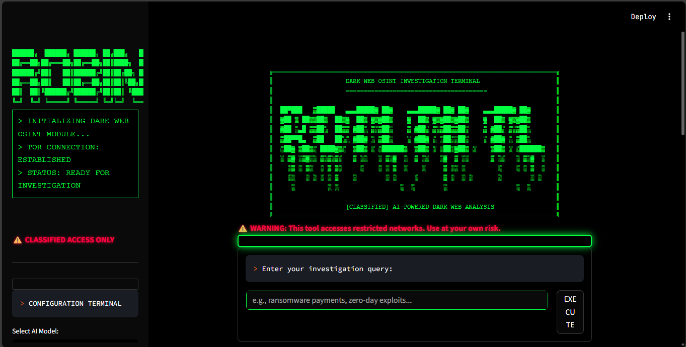
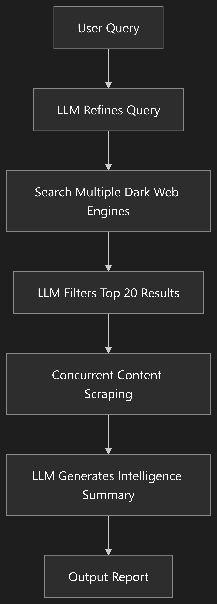

<div align="center">
    <br><a href="https://github.com/lincolnpauldev-Eng/robin-dark-web-osint/actions/workflows/binary.yml"></a> <a href="https://github.com/lincolnpauldev-Eng/robin-dark-web-osint/releases"></a> <a href="https://hub.docker.com/r/lincolnpauldev/robin"></a>
    <h1>🕵️ Robin: AI-Powered Dark Web OSINT Tool</h1>

    <p><strong>Terminal-style dark web investigation tool with AI-powered intelligence gathering</strong></p>
    <p>Robin leverages LLMs to refine queries, filter results from dark web search engines, and generate contextual intelligence summaries with an authentic cyberpunk terminal interface.</p>
    <a href="#features">Features</a> &bull; <a href="#installation">Installation</a> &bull; <a href="#usage">Usage</a> &bull; <a href="#contributing">Contributing</a><br><br>
</div>




---

## Features

- 🖥️ **Dark Web Terminal UI** – Authentic cyberpunk interface with matrix-style aesthetics, ASCII art, and terminal commands
- ⚙️ **Modular Architecture** – Clean separation between search, scrape, and LLM workflows with concurrent processing
- 🤖 **Multi-Model LLM Support** – OpenAI, Claude, Gemini, Ollama, and OpenRouter models with optimized token limits
- 💻 **CLI & Web Interface** – Terminal-first design with Streamlit web UI for interactive investigations
- 🐳 **Docker-Ready** – Containerized deployment with Tor integration for isolated dark web access
- 🔍 **Advanced Intelligence** – AI-powered query refinement, result filtering, and contextual analysis
- 📊 **Investigation Reports** – Structured markdown outputs with artifacts, insights, and next steps
- 🛡️ **API Optimization** – Smart token management to prevent credit limit issues
- 🌐 **Tor Integration** – Automatic SOCKS proxy configuration for anonymous dark web access

---

## ⚠️ Disclaimer
> This tool is intended for educational and lawful investigative purposes only. Accessing or interacting with certain dark web content may be illegal depending on your jurisdiction. The author is not responsible for any misuse of this tool or the data gathered using it.
>
> Use responsibly and at your own risk. Ensure you comply with all relevant laws and institutional policies before conducting OSINT investigations.
>
> Additionally, Robin leverages third-party APIs (including LLMs). Be cautious when sending potentially sensitive queries, and review the terms of service for any API or model provider you use.

## Installation
> [!NOTE]
> The tool needs Tor to do the searches. You can install Tor using `apt install tor` on Linux/Windows(WSL) or `brew install tor` on Mac. Once installed, confirm if Tor is running in the background.

> [!TIP]
> You can provide OpenAI or Anthropic or Google API key by either creating .env file (refer to sample env file in the repo) or by setting env variables in PATH.
>
> For Ollama, provide `http://host.docker.internal:11434` as `OLLAMA_BASE_URL` in your env if running using docker method or `http://127.0.0.1:11434` for other methods. You might need to serve Ollama on 0.0.0.0 depending on your OS. You can do that using `OLLAMA_HOST=0.0.0.0 ollama serve &`.

### Docker (Web UI Mode) [Recommended]

- Pull the latest Robin docker image
```bash
docker pull lincolnpauldev/robin:latest
```

- Run the docker image as:
```bash
docker run --rm \
   -v "$(pwd)/.env:/app/.env" \
   --add-host=host.docker.internal:host-gateway \
   -p 8501:8501 \
   lincolnpauldev/robin:latest ui --ui-port 8501 --ui-host 0.0.0.0
```

### Release Binary (CLI Mode)

- Download the appropriate binary for your system from the [latest release](https://github.com/lincolnpauldev-Eng/robin-dark-web-osint/releases/latest)
- Unzip the file, make it executable
```bash
chmod +x robin
```

- Run the binary as:
```bash
robin cli --model gpt-5-mini-openrouter --query "ransomware payments"
```

### Using Python (Development Version)

- With `Python 3.10+` installed, run the following:

```bash
pip install -r requirements.txt
python main.py -m gpt-4.1 -q "ransomware payments" -t 12
```

---

## Usage

### Terminal Interface
Launch the dark web terminal interface:
```bash
python main.py ui
# Or via Docker
docker run -p 8501:8501 lincolnpauldev/robin:latest ui
```

### CLI Mode
```bash
Robin: AI-Powered Dark Web OSINT Tool

options:
  -h, --help            show this help message and exit
  --model {gpt-5.1-openrouter,gpt-5-mini-openrouter,claude-sonnet-4.5-openrouter,grok-4.1-fast-openrouter,gpt-4.1,claude-sonnet-4-5,gemini-2.5-flash}, -m {gpt-5.1-openrouter,gpt-5-mini-openrouter,claude-sonnet-4.5-openrouter,grok-4.1-fast-openrouter,gpt-4.1,claude-sonnet-4-5,gemini-2.5-flash}
                        Select LLM model (optimized for cost-effective investigations)
  --query QUERY, -q QUERY
                        Dark web search query
  --threads THREADS, -t THREADS
                        Number of threads to use for scraping (Default: 5)
  --output OUTPUT, -o OUTPUT
                        Filename to save the final intelligence summary. If not provided, a filename based on the
                        current date and time is used.

Example commands:
  - robin -m gpt-5-mini-openrouter -q "ransomware payments" -t 12
  - robin --model claude-sonnet-4.5-openrouter --query "sensitive credentials exposure" --threads 8 --output investigation_report
  - robin -m grok-4.1-fast-openrouter -q "zero-day exploits"
  - robin -m gemini-2.5-flash -q "dark web markets"
```

---

## Contributing

Contributions are welcome! Please feel free to submit a Pull Request if you have major feature updates.

- Fork the repository
- Create your feature branch (git checkout -b feature/amazing-feature)
- Commit your changes (git commit -m 'Add some amazing feature')
- Push to the branch (git push origin feature/amazing-feature)
- Open a Pull Request

Open an Issue for any of these situations:
- If you spot a bug or bad code
- If you have a feature request idea
- If you have questions or doubts about usage
- If you have minor code changes

---

## Acknowledgements

- **Original Concept**: Inspired by [Thomas Roccia](https://x.com/fr0gger_) and his demo of [Perplexity of the Dark Web](https://x.com/fr0gger_/status/1908051083068645558)
- **Core Architecture**: Based on [apurvsinghgautam/robin](https://github.com/apurvsinghgautam/robin) - the original AI-powered dark web OSINT tool
- **OSINT Framework**: LLM prompt inspiration from [OSINT-Assistant](https://github.com/AXRoux/OSINT-Assistant) repository
- **Terminal UI Design**: Cyberpunk aesthetics and dark web styling by [Lincoln Paul](https://github.com/lincolnpauldev-Eng)
- **Workflow Visualization**: Process diagrams by [Chintan Gurjar](https://www.linkedin.com/in/chintangurjar)
- **Community**: Thanks to all contributors and the cybersecurity research community


